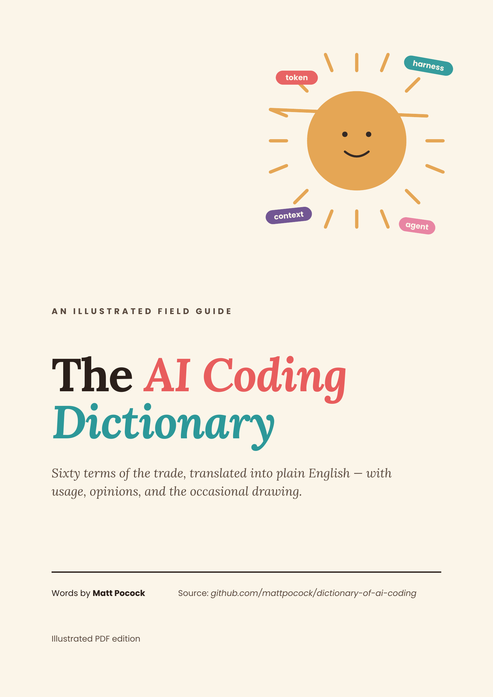

# The AI Coding Dictionary — Illustrated PDF

### **[→ Read the PDF](./AI-Coding-Dictionary.pdf)** &nbsp;·&nbsp; **[↓ Download](https://github.com/ozudev/dictionary-of-ai-coding/raw/main/AI-Coding-Dictionary.pdf)**

---

An illustrated, designed PDF edition of Matt Pocock's [AI Coding Dictionary](https://github.com/mattpocock/dictionary-of-ai-coding) — sixty terms of AI coding jargon, translated into plain English, with usage dialogues and two original infographics across 38 colour-coded pages.

All words by **[Matt Pocock](https://github.com/mattpocock)**. This repo is just a designed presentation layer on top of his work. Subscribe at **[aihero.dev](https://www.aihero.dev/s/dictionary-newsletter)** for more.
